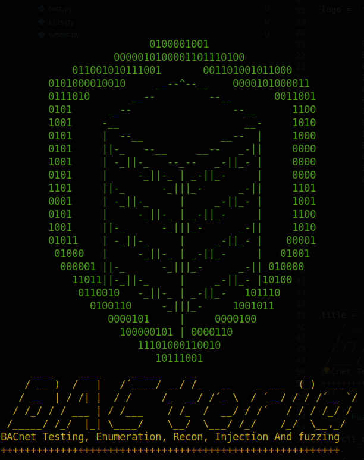

<p align="center">
  
</p>

# BACteria

**The Metasploit of BACnet** — A powerful offensive security CLI tool for penetration testing BACnet networks, supporting both **BACnet/IP** and **BACnet/SC**.

BACteria is a CLI-based offensive framework designed to test, fuzz, and exploit Building Automation Systems (BAS) that use the BACnet protocol. Whether you're conducting red team engagements or exploring protocol weaknesses, BACteria provides robust modules for reconnaissance, fuzzing, attacks, and control manipulation.

---

## 🚀 Features

- 🔍 **Recon Modules**
  - Device information, services, objects, and network scanning
- 💥 **Fuzzing**
  - Stateful and session-resumable fuzzing for specific services
- 🧬 **Action Modules**
  - Property manipulation, object creation/deletion, file dumping
  - Use curent device as proxy to forward message to other device in the network (lateral movement)
- ⚔️ **Attack Modules**
  - Bruteforce credentials
  - Time wraparound exploit (2038 bug)
  - Targeted device crash (e.g., Siemens PXC3)
- 🔧 **Utilities**
  - Terminal control, help menus, clean exits
- 🌐 **Dual Stack Support**
  - Fully compatible with both **BACnet/IP** and **BACnet/SC** protocols

---

## 📦 Installation

> **Note:** BACteria is intended for legal use only by authorized professionals on systems you own or have explicit permission to test.

```bash
git clone https://github.com/cyber-defence-campus/BACteria.git
cd BACteria

# Use a virtualenv to avoid system-Python restrictions
python3 -m venv .venv
. .venv/bin/activate

# Build and install
python -m pip install -U pip build installer
python -m build --wheel
python -m pip install --force-reinstall dist/*.whl
```

---

## 🧠 Usage

When BACteria starts, it will automatically scan the target device if no port is provided, searching for:
- Open **BACnet/IP** ports (default UDP/47808)
- Open **BACnet/SC** ports over TLS/WebSockets

### CLI Startup

```bash
$ bacteria <ip> <port>
<or>
$ python3 cli.py <ip> <port>
```

You'll be greeted with the ASCII logo and prompt. use help for a list  of action
### Example Commands

#### === Recon ===

```bash
info                                  # Show basic information about the target device
device_properties                     # Enumerate all properties on the target device
services_supported                    # List all services the device claims to support
objects_supported                     # Show all object types supported by the device
list_objects                          # Enumerate all instantiated objects on the device
properties analogInput:1              # Show all properties of object analogInput with instance 1
event_info                            # List currently active event states on the device
network_info                          # Show details about the network link and addressing
find_devices                          # Enumerate devices reachable from the current device
```

#### === Fuzzing ===

```bash
new_fuzzing readProperty              # Start a new fuzzing session targeting readProperty service
resume_fuzzing                        # Resume the last fuzzing session that was active
load_fuzzing 5                        # Load a specific fuzzing session by its ID
fuzzing_sessions                      # List all saved and running fuzzing sessions
```

#### === Action ===

```bash
dump 12345 output.bin                 # Dump a file or object instance (12345) to output.bin
set_property analogValue 2 presentValue real 22.5 8     # Set presentValue of analogValue 2 to 22.5 with priority 8
set_property_at_index analogValue 2 priorityArray real 20.0 8 5    # Set index 5 of priorityArray to 20.0 with priority 8
create analogInput 5                 # Create a new object of type analogInput with instance 5
delete analogInput 5                 # Delete the analogInput object with instance 5
reinitialize warmStart pwd           # Reinitialize the device to warmStart state using a password
enable pwd                           # Enable device functions using the password
disable pwd                          # Disable the device until next enable or reinit
change_time 01.01.2025 12:00:00:00   # Set the device clock to January 1st, 2025 at noon
connect <?vmac>                      # Connect to another device in network via the current one (use find_devices for possible devices)
set_network_number <n>               # Change the network number of the communication

```

#### === Attacks ===

```bash
bruteforce wordlist.txt 4            # Start brute-forcing from line 4 in the wordlist
time_wraparound                      # Set time to post-2038 date to trigger timestamp overflows
```


## 🔐 Responsible Usage

This tool is for educational and authorized security testing purposes **only**. Misuse may be illegal and unethical.

> Always get **written permission** before testing systems.

---

## 📅 Roadmap

- [ ] CLI autocompletion
- [ ] Plugin/module system
- [ ] BACnet/MSTP support
- [ ] Real-time packet logging, MITM and replay

---

## 👨‍💻 Contributing

Pull requests are welcome. For major changes, open an issue first to discuss your ideas.

To contribute:

```bash
git clone https://github.com/cyber-defence-campus/BACteria.git
cd BACteria
# Start hacking!
```

---


## 🏢 About BACnet

**BACnet (Building Automation and Control Networks)** is a communication protocol widely used in building systems such as HVAC, lighting, fire detection, and access control. **BACnet/SC (Secure Connect)** is the newer, secure, TLS-based version of the protocol introduced to address security shortcomings in BACnet/IP.

---

## 🙌 Acknowledgements

This is project was developed during my intership at CYD campus under the supervision of Nicolas Oberli and Bernhard Tellenbach.

Inspired by:
- Metasploit Framework
- Nmap's BACnet NSE scripts
- Community research on building automation security
